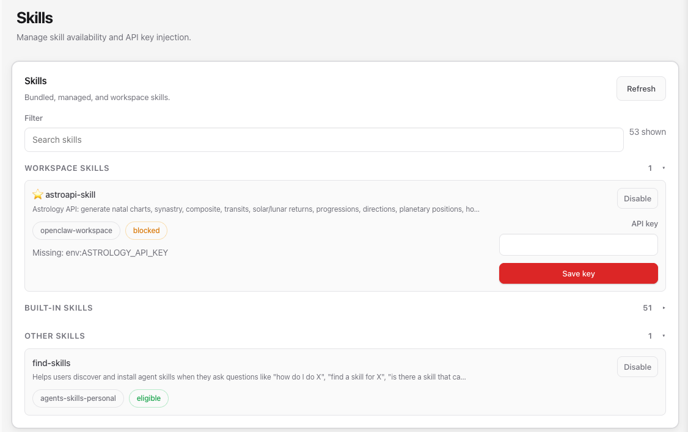

# Installation Guide

## 1. Install from ClawHub

```bash
clawhub install astroapi-skill
```

After installation, the skill appears in **Workspace Skills** on the Skills page.

## 2. Set Up the API Key

To use the skill, you need an API key from the [Astrology API Dashboard](https://dashboard.astrology-api.io/).

1. Go to [dashboard.astrology-api.io](https://dashboard.astrology-api.io/) and sign up or log in.
2. Copy your API key from the dashboard.
3. Open the **Skills** page in OpenClaw (Settings → Skills).
4. Find **astroapi-skill** under **Workspace Skills**.
5. Paste your API key into the **API key** field and click **Save key**.



> Until the API key is saved, the skill will show a **blocked** status with the message `Missing: env:ASTROLOGY_API_KEY`. Once the key is saved, the status changes to **eligible** and the skill is ready to use.

## 3. Verify

Ask your agent something like:

```
What are the planetary positions right now?
```

or:

```
Build a natal chart for March 15, 1990, 2:30 PM, New York
```

If the skill is configured correctly, the agent will call the Astrology API and return the results.

## Manual Installation

If you prefer not to use ClawHub, you can install the skill manually.

### OpenClaw

```bash
git clone https://github.com/astro-api/astroapi-skill ~/skills/astroapi-skill
ln -s ~/skills/astroapi-skill ~/.openclaw/skills/astroapi-skill
```

### Claude Code

```bash
git clone https://github.com/astro-api/astroapi-skill ~/skills/astroapi-skill
ln -s ~/skills/astroapi-skill ~/.claude/skills/astroapi-skill
```

### OpenAI Codex

```bash
git clone https://github.com/astro-api/astroapi-skill ~/skills/astroapi-skill
ln -s ~/skills/astroapi-skill ~/.codex/skills/astroapi-skill
```

### Other Platforms

Symlink or copy the `astroapi-skill` directory to your platform's skills directory.

For manual installations, set the API key as an environment variable:

```bash
export ASTROLOGY_API_KEY="your_token_here"
```
